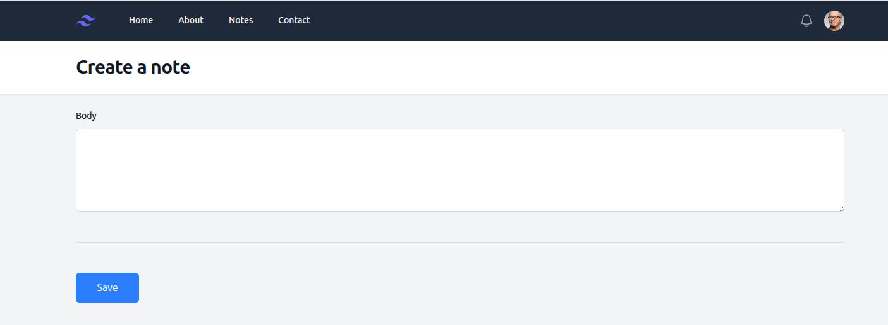

# Notes Scout 📝

Une application de prise de notes moderne et efficace.



## 📋 Fonctionnalités

- Création et gestion de notes
- Organisation par catégories
- Recherche rapide
- Interface intuitive

## 🚀 Installation

1. Clonez le repository
```bash
git clone https://github.com/NlengDominique/notesscout.git
cd notesscout
```

2. Configurez votre environnement
- Créez une base de données MySQL
- Copiez le fichier `.env.example` vers `.env` et configurez vos variables d'environnement
- Importez la structure de la base de données depuis `database.sql`
3. Installez le projet
```bash
# Importez la base de données
mysql -u votre_utilisateur -p votre_base < database.sql

# Configurez la connexion à la base de données
# Modifiez les informations de connexion dans config/database.php
```

4. Démarrez votre serveur web local
```bash
# Avec PHP built-in server
php -S localhost:8888

# Ou utilisez Apache/Nginx en pointant vers le dossier du projet
```

5. Accédez à l'application via `http://localhost:8888`

## 🛠️ Technologies utilisées

- HTML5
- JavaScript
- Tailwind CSS
- PHP
- MySQL
<!-- 
## 📸 Captures d'écran

### Page d'accueil


### Éditeur de notes


### Mode sombre
 -->

## 🤝 Contribution

Les contributions sont les bienvenues ! N'hésitez pas à :

1. Fork le projet
2. Créer une branche (`git checkout -b feature/AmazingFeature`)
3. Commit vos changements (`git commit -m 'Add some AmazingFeature'`)
4. Push sur la branche (`git push origin feature/AmazingFeature`)
5. Ouvrir une Pull Request

## 📝 License

Ce projet est sous licence MIT - voir le fichier [LICENSE.md](LICENSE.md) pour plus de détails.

